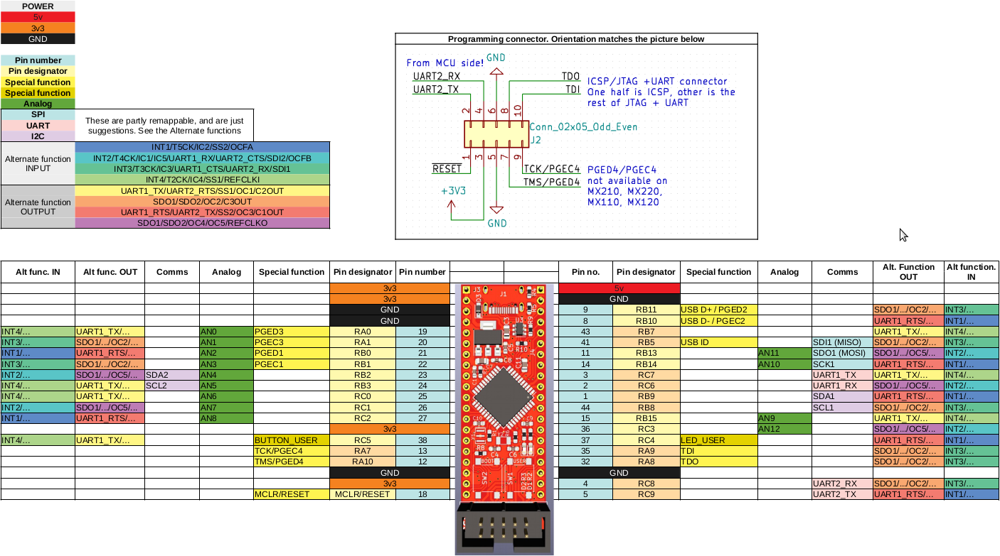
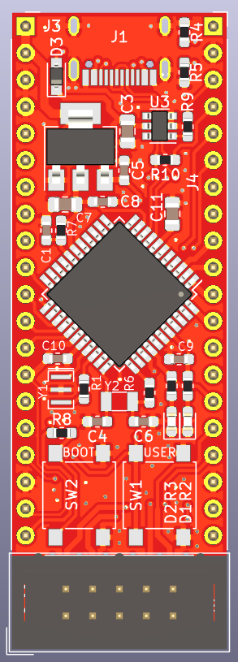
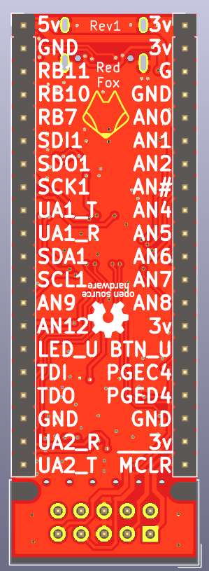
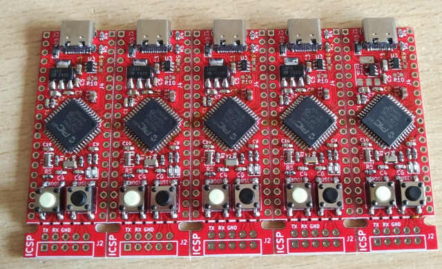
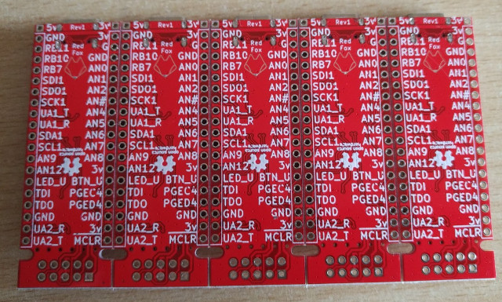

# RedFoxBoard
A PIC32MX250 (and others) board, similar to the ubiquitous Blue Pill board

## Pinout

#### PCB view

#### Panel view

## Description 

This is a small development board, featured around a PIC32MX microcontroller.

The intent is to have a small Blue Pill-like board, that can be quickly used with an open-source toolchain for the PIC32MX (see https://gitlab.com/rhn/pic32-parts-free )

The feature list is as follows:
- USB-C connector
- Two LEDs, one Power, one User
- Two buttons, one Reset, one User
- Components only on one side
- Footprints for two 3.3V regulators (smaller or bigger, depending on your needs)
- Fits into DIP-40 socket
- Breakaway section on the PCB, with place for an ICSP or JTAG connector

The purpose of the breakaway is to have a convenient place for programming/debugging. The same pins are also exposed on the side pins. To remove the breakaway, score the vias with a knife, then break it off.

Apart from the oscillator pins, everything is connected to the side pins.

If you do not wish to use USB functionality, you can place resistors R9 and R10, and connect those pins to the side as well.

### Supported MCUs
It supports the following microcontrollers:
- PIC32MX270F256D
- PIC32MX250F128D
- PIC32MX230F256D
- PIC32MX230F064D
- PIC32MX170F256D (without USB)
- PIC32MX150F128D (without USB)
- PIC32MX130F256D (without USB)
- PIC32MX130F064D (without USB)

Additionally, the following can also be used, but ICSP pins are not available on the provided header (use the ones on the side):
- PIC32MX220F032D
- PIC32MX210F016D
- PIC32MX120F032D (without USB)
- PIC32MX110F016D (without USB)

#### Notes

Please note, there are 6mm push buttons with different spacings on the pins. Make sure to get the right ones

The series resistor with the main oscillator hasn't been checked yet

The capacitors for the 32.768kHz crystal haven't been checked yet.
